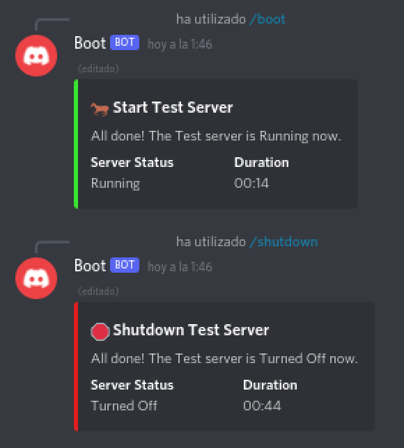

# Discord Azure Boot
Discord bot which starts and stops game servers running on Azure Virtual Machines.

# Table Of Contents
- [Overview](#overview)
- [Setup](#setup)
- [Development](#development)
- [Deployment](#deployment)
- [Design](#design)

# Overview
Allows trusted Discord users to start and stop Azure virtual machines. Useful if you are running a game server on Azure and want to allow friends to turn on the server. This bot also automatically shuts down servers after all users leave the voice chat (only if a user initially requested it turned on).



# Setup
## Configuration File
Make a copy of `config.ex.ts` named `config.ts`. Edit this `config.ts` file with your own values, make sure not to commit it to git.

The comments in the example file provide details about each configuration field. Additionally the [Azure Cloud setup](#azure-cloud) and [Discord setup](#discord) sections provide details about how to setup and find these values.

## Azure Cloud
Setup an Application in your Active Directory:

1. Navigate to the "Azure Active Directory" dashboard page
2. Navigate to the "App Registrations" sub-page under the manage category
3. Click the "New registration" button to create a new App Registration, select "Accounts in this organizational directory only (Default Directory only - Single tenant)", no redirect URI, then register
4. On the created App Registration's overview page copy the "Application (client) ID" (for config: `azure.applicationID`) and "Directory (tenant) ID" (for config: `azure.directoryID`) for later
5. Navigate to the "Certificates & secrets" sub-page of the App Registration, under the manage category
6. Click the "New Client Secret" button, then hit "Add", copy its value (for config: `azure.accessToken`) for later use

Give the Application permission to view resources:

1. Navigate to the "Subscriptions" page by searching it in the top bar
2. Click on the subscription under which virtual machines exist
3. Navigate to the "Access control (IAM)" sub-page
4. Click the "Add role assignment" button
   1. Role: Select a role which allows the Application to list, get, stop, and start the virtual machines you wish this bot to manage, then click "Next"
   2. Members
     1. Assign access to: Select "User, group, or service principal"
	 2. Members: Click the "Select members" button, then select your Application (I've found that it will not show up in the initial list, and that you must type its name for it to show up), click select
     3. Click "Next"
   3. Review + assign: Click "Review + assign"

Gather information about virtual machines:

1. Navigate to the "Virtual Machines" dashboard page
2. Click on the virtual machine you wish to manage with this bot
3. Save the "Resource group" (for config: `vms.$.resourceGroup`) and virtual machine name (for config: `vms.$.azureName`) for later

## Discord
Create a new Discord API application with a bot user. Save the bot token for later use.

Invite the bot with the following permissions:

- Use Slash Commands: The bot is invoked using Slash commands

The permission integer is: `2147483648`.

the bot invite URL is:

```
https://discord.com/api/oauth2/authorize?client_id=<...>&scope=bot&permissions=2147483648
```

This will be printed to the console every time the bot starts.

Authorize the application via OAuth2. This is separate from the bot, and provides the overall Discord API application access. Authorize with the OAuth2 scopes:

- `applications.commands`: Used to manage slash commands

This can be done by visiting a URL in the form:

```
https://discord.com/api/oauth2/authorize?client_id=<...>&scope=applications.commands
```

This will be printed to the console every time the bot starts.

# Development
Written in Typescript. MongoDB is used to store data about server start requests.

Install dependencies:

```
yarn install
```

To start MongoDB a Docker Compose file with MongoDB setup is provided. To start MongoDB using this file run:

```
docker-compose up -d
```

(You may run your own MongoDB server, just modify the `mongodb` configuration values)

Follow instructions in [Setup](#setup) to create the necessary Azure resources and a configuration file.

Run the bot:

```
yarn start
```

# Deployment
A Docker container and Docker Compose file  named `docker-copose.bot.yml` are provided which run the bot process.

Use this Docker Compose file with the `docker-compose.yml` file to run MongoDB alongside the bot (The [`./dc`](./dc) script helps with this).

To run the bot inside a container you must configure the `mongodb.connectionURI` to point to the MongoDB container IP. With Docker Compose the hostname `mongo` will also point to the MongoDB container.

# Design
User's interact with the bot using slash commands. These are only under the bot's control for 15 minutes ([Discord Slash Command Response Docs](https://discord.com/developers/docs/interactions/slash-commands#responding-to-an-interaction)). As such, all commands must complete within 15 minutes, meaning all server's should start in under 15 minutes.
